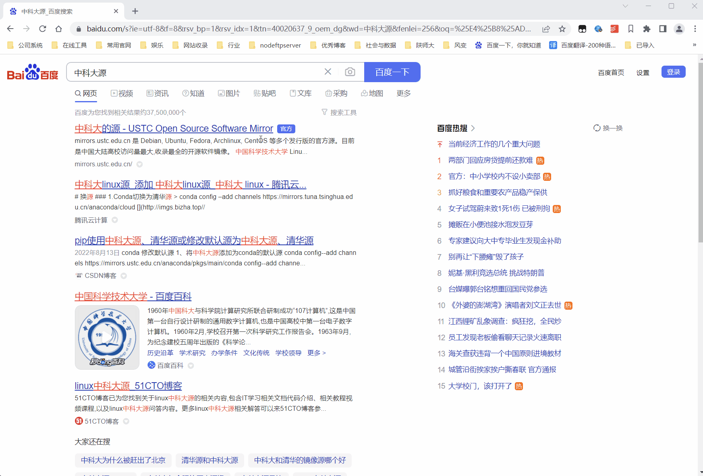

## ubuntu初始化脚本

---
> root登录  
> 第一次登录时，root密码没有设置，登不上去的
```shell
sudo passwd
123456

su root
123456
```
---
> 设置源

搜索关键字 `中科大 源`  
找看着像是官网的，一般第一条就是。域名为 [http://mirrors.ustc.edu.cn/](http://mirrors.ustc.edu.cn/)

```shell
cp /etc/apt/sources.list /etc/apt/sources.list.back
sudo sed -i 's@//.*archive.ubuntu.com@//mirrors.ustc.edu.cn@g' /etc/apt/sources.list
sudo sed -i 's/security.ubuntu.com/mirrors.ustc.edu.cn/g' /etc/apt/sources.list
sudo sed -i 's/http:/https:/g' /etc/apt/sources.list
apt update
```
---
> 安装软件 [脚本下载](images/init_software.sh)
```shell
#!/bin/bash

#需要安装的软件
echo '本脚本尝试安装基础命令：net-tools, sshd，rsnapshot'
echo '本脚本尝试安装开发工具：git, jdk8, python3, gradle, node, rust, docker'
# 备份/etc/prifile
cp /etc/profile /etc/profile.back

# 基本工具
echo '---> net-tools:'
if[[ -z $(type -afp netstat) ]]; then
    echo 'net-tools正在安装...'
    apt install net-tools -y
    echo 'net-tools安装成功'
else
    echo 'net-tools已存在'
fi

echo '---> openssh-server:'
apt search openssh | grep -E '^openssh-server*installed'
if[[ $? != 0 ]]; then
    echo 'openssh-server正在安装...'
    apt install openssh-server -y
    echo '配置允许root远程登陆...'
    cp /etc/ssh/sshd_config /etc/ssh/sshd_config.back
    sed -i '/^#PermitRootLogin prohibit-passwor/a\PermitRootLogin yes' /etc/ssh/sshd_config
    # wsl 不支持使用systemctl命令
    service ssh starth
    echo 'sshd安装成功'
else
    echo 'sshd已存在'
fi


# git
echo '---> git:'
if [[ -z $(type -afp git) ]]; then
    echo 'git正在安装...'
    apt install git -y
    echo 'git安装成功'
else
    echo 'git已存在'
fi

# jdk
echo '---> jdk'
if [[ -z $(type -afp java) ]]; then
    echo 'jdk8(openjdk-8-jdk)正在安装...'
    apt install openjdk-8-jdk-headless -y
    echo 'jdk8安装成功'
else
    cur_java_version=$(java -version 2>&1 | grep 'version' | sed 's/"//g' | awk '{print $3}')
    echo "java已存在, 版本为：${cur_java_version}"
    if [[ ${cur_java_version} =~ '1.8' ]]; then
	echo '好巧，老子想装的就是1.8'
    else
	echo '依然安装jdk8'
	apt install openjdk-8-jdk-headless -y
	echo 'jdk8安装成功，此时环境变量默认为jdk8生效，若要切换为jdk${cur_java_version}, 使用 update-alternatives 命令'
    fi
    apt list 'openjdk*' | grep -E '^openjdk-[0-9]{1,2}-jdk.*installed'    
    if [[ $? != 0 ]]; then
        echo '警告:环境中默认只安装了jre,但未安装jdk'
    fi
fi

# python3
echo '---> python3'
if [[ -z $(type -afp python3) ]]; then
    echo 'python3正在安装...'
    apt install python3 -y
    echo 'python3安装成功'
else
    echo 'python3已存在'
fi


# gradle 版本太老，需要更新源
echo '---> gradle'
if [[ -z $(type -afp gradle) ]]; then
    echo 'gradle正在安装...'
    apt install gradle -y
    echo 'gradle安装成功'
else
    echo 'gradle已存在'
fi


# nvm
echo '---> nvm'
if [[ -z $(type -afp nvm) ]]; then
    echo 'nvm正在安装...'
    #以下代码均为官方提供安装方式，curl方式注释掉了，因为网络不通
    #curl -o- https://raw.githubusercontent.com/nvm-sh/nvm/v0.39.3/install.sh | bash
    export NVM_DIR="$HOME/.nvm" && (
        git clone https://github.com/nvm-sh/nvm.git "$NVM_DIR"
        cd "$NVM_DIR"
        git checkout `git describe --abbrev=0 --tags --match "v[0-9]*" $(git rev-list --tags --max-count=1)`
    ) && \. "$NVM_DIR/nvm.sh"
    
    export NVM_DIR="$HOME/.nvm"
    [ -s "$NVM_DIR/nvm.sh" ] && \. "$NVM_DIR/nvm.sh"
    [ -s "$NVM_DIR/bash_completion" ] && \. "$NVM_DIR/bash_completion"
    #设置nvm源,不设置也没关系，网络还可以
    export NVM_NODEJS_ORG_MIRROR="https://mirrors.ustc.edu.cn/node/"
    
    # 永久的所用用户env
    echo 'export NVM_DIR=/root/.nvm/' >> /etc/profile
    echo 'export NVM_NODEJS_ORG_MIRROR=https://mirrors.ustc.edu.cn/node/' >> /etc/profile
    echo 'export PATH=$NVM_DIR%:$PATH'
    source /etc/profile
    echo 'nvm安装成功'
else
    echo 'nvm已存在'
fi

# node
echo '---> node'
if [[ -z $(type -afp node) ]]; then
    echo 'node最新LTS正在安装...'
    nvm install --lts
    echo 'node安装成功,版本为' $(node -v)
else
    echo 'node已存在'
fi

# rust 
echo '---> rust'
if [[ -z $(type -afp rustup) ]]; then
    echo 'rust正在安装'
    #脚本来自rust官网
    curl --proto '=https' --tlsv1.2 -sSf https://sh.rustup.rs | sh <<EOF
1
EOF
    echo 'rust安装成功,版本为' $(rustup -V)
else
    echo 'rust已存在'
fi

# docker
echo '---> docker'
if [[ -z $(type -afp docker) ]]; then
    echo 'docker正在安装...'
    # 脚本来自中科大与docker官方
    apt install \
        ca-certificates \
        curl \
        gnupg \
        lsb-release
    # 存放GPG密钥的目录
    sudo mkdir -m 0755 -p /etc/apt/keyrings
    # 获取密钥并存储
    curl -fsSL https://mirrors.ustc.edu.cn/docker-ce/linux/ubuntu/gpg | sudo gpg --dearmor -o /etc/apt/keyrings/docker.gpg
    # 配置dockery源
    echo \
        "deb [arch=$(dpkg --print-architecture) signed-by=/etc/apt/keyrings/docker.gpg] https://mirrors.ustc.edu.cn/docker-ce/linux/ubuntu \
        $(lsb_release -cs) stable" | sudo tee /etc/apt/sources.list.d/docker.list > /dev/null
    # 更新索引
    apt update -y
    # 安装
    apt install docker-ce docker-ce-cli containerd.io docker-buildx-plugin docker-compose-plugin -y
    
    echo 'docker安装成功,版本为' $(docker -v)
else
    echo 'docker已存在'
fi

# rsnapshot
echo '---> rsnapshot'
if [[ -z $(type -afp rsnapshot) ]]; then
    echo 'rsnapshot正在安装...'
    apt install rsnapshot -y
        
    echo 'rsnapshot安装成功'
else
    echo 'rsnapshot已存在'
fi

echo '脚本执行完毕'
```