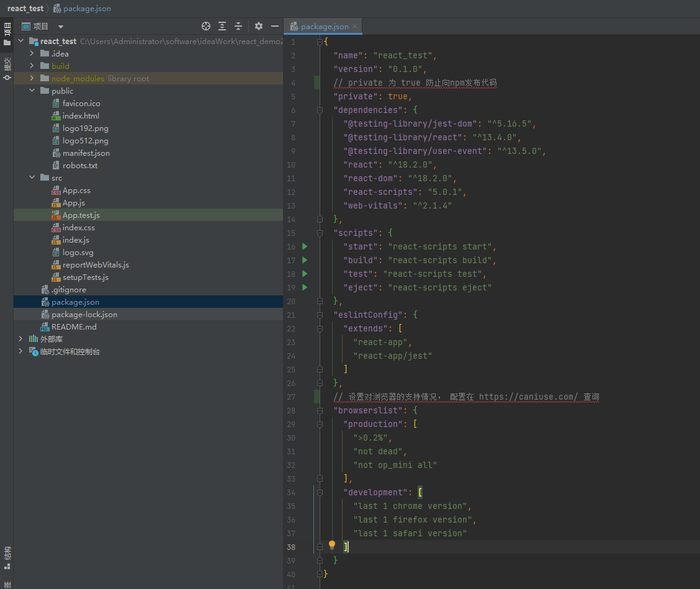

## react 入门
## 认识
> 仅在用到时有能力修改代码，并不深入学习  
> [国内翻译官网](https://zh-hans.reactjs.org/https://zh-hans.reactjs.org/)
 
* react采用了`jsx`语法， jsx时js的语法扩展
* 组件 Component
* 组件的属性集 Props
* 组件状态 state

### 思想
```text
声明一个个组件，组件之间排列组合可以构成复杂的页面
组件之间通过`props`传值
组件通过`state`保存状态
```

## 初始化项目
命令
```shell
npx create-react-app react_test
```
## 目录说明
注意下图json中在运行时不能有注释

```text
├─public
│   favicon.ico
│   index.html ---------- html容器
│   logo192.png
│   logo512.png
│   manifest.json ------- 配置文件
│   robots.txt ---------- 机器人排除协议
│      
└─src
    App.css
    App.js -------------- jsx语法描述页面，在index.js中引用
    App.test.js        
    index.css          
    index.js ------------ react业务代码与html的中间层
    logo.svg
    reportWebVitals.js -- 监控性能，在index.js中初始化
    setupTests.js
```
## 代码示例


